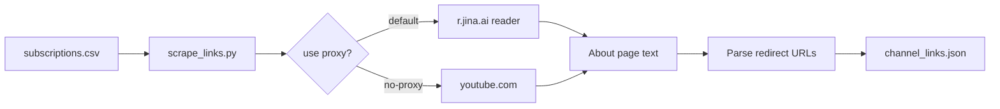

<div align="center">

# YouTube Channel Link Scraper

**Turn your Google Takeout `subscriptions.csv` into a single JSON file of each channel’s external links (Patreon, socials, stores, and more).**

[](https://www.python.org/downloads/)
[](https://github.com/evenwebb/youtube-channel-link-scraper/blob/main/scrape_links.py)
[](https://www.gnu.org/licenses/gpl-3.0)
[](https://github.com/evenwebb/youtube-channel-link-scraper)

</div>

---

## Contents

- [Why this exists](#why-this-exists)
- [Features](#features)
- [Quick start](#quick-start)
- [Installation & prerequisites](#installation--prerequisites)
- [Usage](#usage)
- [How it works](#how-it-works)
- [Project layout](#project-layout)
- [Testing](#testing)
- [Output format](#output-format)
- [Limitations](#limitations)
- [License](#license)
- [Support](#support)

---

## Why this exists

Google Takeout gives you every subscribed channel in `subscriptions.csv`, but finding Patreon, Instagram, merch, and other links means opening each channel’s **About** page by hand. This tool walks that list, pulls those links in bulk, and writes one JSON file you can search or script against.

Pages are fetched through the public **[r.jina.ai](https://r.jina.ai)** reader proxy so runs are less likely to hit YouTube rate limits or blocks than raw `youtube.com` requests. Be polite: keep the default delay between channels.

---

## Features

| | |
|--|--|
| **Takeout-native** | Reads the standard `subscriptions.csv` column names (`Channel Title`, `Channel Url`, etc.). |
| **Ordered links** | Preserves header / metadata / description priority and drops duplicate targets. |
| **Resumable-friendly** | Output JSON is written after **each** channel so partial runs are not lost. |
| **Filtering** | `-f` / `--filter` to keep only URLs matching substrings (repeatable, OR logic). |
| **Direct or proxy** | `--no-proxy` to hit YouTube directly when you accept stricter rate limits. |
| **Parallel scraping** | `-w` / `--workers` for concurrent channel processing with configurable parallelism. |
| **HTML output** | `--html` generates a styled HTML report alongside the Markdown output. |
| **Dead link checking** | `--check-links` verifies each extracted URL and flags broken links. |
| **Change diffing** | `--diff` shows which links were added/removed since the last scrape. |
| **No pip deps** | Single `scrape_links.py`, Python standard library only. |
| **Tested** | `unittest` suite under `tests/`, plus CI workflow with Dependabot. |

---

## Quick start

```bash
git clone https://github.com/evenwebb/youtube-channel-link-scraper.git
cd youtube-channel-link-scraper
python scrape_links.py sample_subscriptions.csv -o sample_links.json --delay 0
```

Replace `sample_subscriptions.csv` with your own Takeout export path when ready.

---

## Installation & prerequisites

| Requirement | Notes |
|-------------|--------|
| **Python** | 3.10 or newer |
| **Dependencies** | None (stdlib only) |
| **Data** | A `subscriptions.csv` from [Google Takeout](https://takeout.google.com/) (YouTube → subscriptions) |

No `pip install` is required. Clone or download the repo and run `scrape_links.py`.

> **Note:** Run commands from the repository root (or put the repo on `PYTHONPATH`) if you `import scrape_links` from tests or other scripts.

---

## Usage

```bash
python scrape_links.py /path/to/subscriptions.csv -o channel_links.json
```

### CLI options

| Flag | Description |
|------|-------------|
| `-o` / `--output` | JSON path (default: `channel_links.json` in the current working directory). |
| `--delay` | Seconds between channels (default `0.5`). Raise for large lists or flaky networks. |
| `-f` / `--filter` | Only include links containing this substring; repeat for OR logic. |
| `--no-progress` | Quiet mode (no per-channel lines). |
| `--no-proxy` | Fetch `youtube.com` directly instead of via `r.jina.ai`. |

### Filter example

```bash
python scrape_links.py subscriptions.csv -o socials.json -f patreon.com -f instagram.com
```

---

## How it works



---

## Project layout

| Path | Purpose |
|------|---------|
| `scrape_links.py` | CLI and importable module. |
| `sample_subscriptions.csv` | Minimal Takeout-style sample for dry runs. |
| `tests/` | Unit tests (`unittest`). |
| `pyproject.toml` | Optional [Ruff](https://docs.astral.sh/ruff/) settings for contributors. |
| `LICENSE` | GNU General Public License v3.0 (full text). |

---

## Testing

From the repository root:

```bash
python -m unittest discover -s tests -v
```

---

## Output format

Each entry includes the channel title, a canonical channel URL, and an ordered `links` list:

```json
[
  {
    "channel_title": "T90Official - Age Of Empires 2",
    "channel_url": "https://www.youtube.com/channel/UCZUT79WUUpZlZ-XMF7l4CFg",
    "links": [
      "http://bit.ly/2z4T4rm",
      "https://www.facebook.com/T90Official",
      "https://teespring.com/stores/t90officials-store",
      "https://www.patreon.com/T90Official",
      "https://twitter.com/t90official",
      "https://www.instagram.com/t90official/",
      "https://www.twitch.tv/t90official"
    ]
  }
]
```

---

## Limitations

- Parsing depends on YouTube continuing to expose outbound links as `youtube.com/redirect?...` in the fetched page text; markup changes can break extraction.
- The default proxy has its own rate limits; use `--delay` and avoid hammering the service.
- `--no-proxy` may work poorly in data centers or automated environments.

<details>
<summary><strong>Troubleshooting</strong></summary>

- **Empty `links` for some channels** — The channel may hide links, or the page layout may have changed. Try `--no-proxy` once to compare (respect rate limits).
- **`ModuleNotFoundError: scrape_links`** — Run tests or scripts from the repo root, or set `PYTHONPATH` to this directory.
- **HTTP 429** — The tool backs off and retries for proxy 429s; increase `--delay` between channels.

</details>

---

## License

This project is licensed under the **GNU General Public License v3.0** (or later). See the [`LICENSE`](LICENSE) file in this repository for the full text.

---

## Support

- **Issues & ideas:** [GitHub Issues](https://github.com/evenwebb/youtube-channel-link-scraper/issues)
- **Author:** [@evenwebb](https://github.com/evenwebb)
